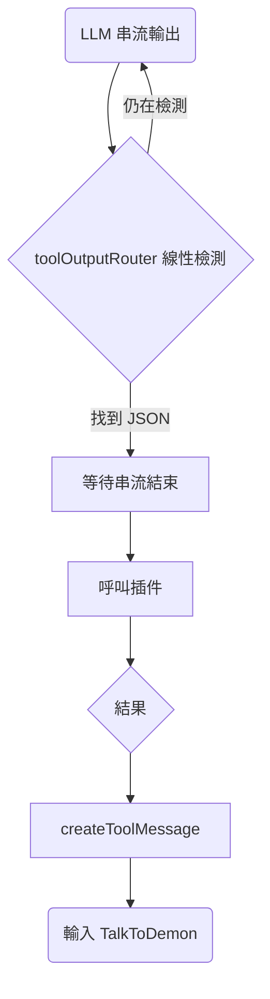

# toolOutputRouter 與 PromptComposer 流程圖

```mermaid
graph TD
  A(LLM 串流輸出) --> B{toolOutputRouter 線性檢測}
  B -- 找到 JSON --> C[等待串流結束]
  B -- 仍在檢測 --> A
  C --> D[呼叫插件]
  D --> E{結果}
  E --> F[createToolMessage]
  F --> G(輸入 TalkToDemon)
```
