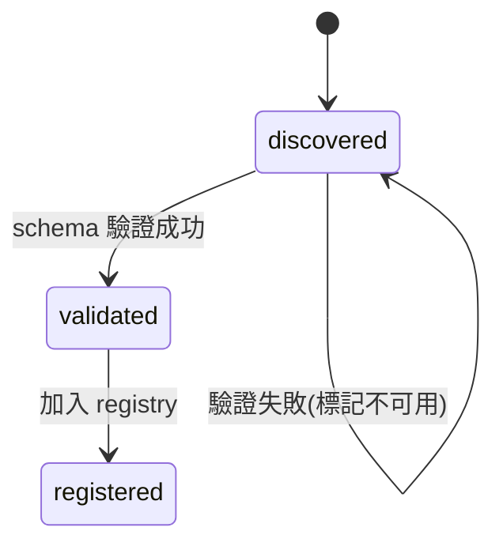
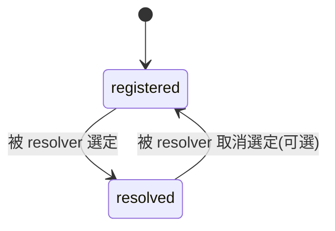
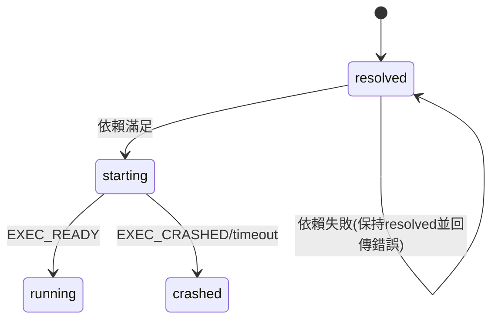
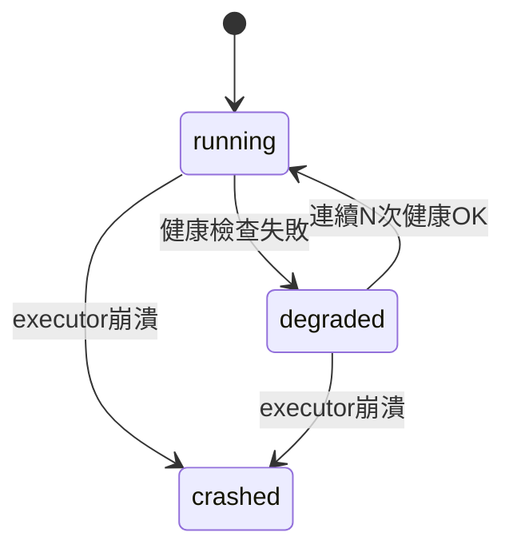
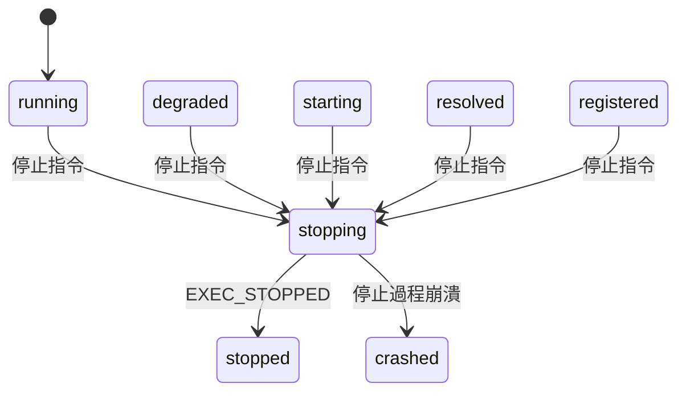

# 插件生命週期規格 (Plugin Lifecycle Specification)

## 1. 目的與範圍

本文件定義 `pluginsManager` 的「插件生命週期（Lifecycle）」行為，包含：

- Plugin 與 Strategy 的狀態機（State Machine）
- 狀態轉移（Transitions）與觸發事件（Events）
- 啟動/停止/崩潰/降級（degraded）/fallback 行為
- 與 `dependency.md`（依賴）與 `resolver.md`（策略選擇）的銜接規則
- 跨 executor 一致：`in_process` / `worker` / `child_process` / `remote` 都必須遵守同一套狀態語意

本規格不定義 UI 或 logging 格式，但要求標準化錯誤碼與事件。**

## 2. 核心原則（不可違反）

| 原則 | 說明 |
|------|------|
| **Manager 才能推進狀態** | Plugin/Executor 不可自行「宣告 running」，只能回報事件，由 manager 更新狀態 |
| **狀態必須可重現** | 同一事件序列，狀態轉移結果一致 |
| **依賴先滿足再啟動** | `required` 依賴未滿足不得進入 `starting` |
| **策略選擇 deterministic** | resolver 同分 tie-break 固定 |
| **失敗不隱藏** | Fail fast + 明確錯誤碼 + 保留 trace（pluginId, strategyId, requestId） |

## 3. 管理對象：Plugin vs Strategy

- **Plugin**：邏輯單位（`pluginId`），包含多個 strategies
- **Strategy**：執行單位（`pluginId` + `strategyId`），每個 strategy 對應一種 `executor`+`entry`

> 📌 **生命週期以 Strategy 為主要狀態機；Plugin 狀態是聚合視圖（由其 strategies 推導）。**

## 4. Strategy 狀態定義（State）

Strategy 狀態集合（必須支援）：

| 狀態 | 說明 |
|------|------|
| `discovered` | 已被掃描到，但尚未驗證 schema |
| `validated` | manifest schema 驗證通過（語法/結構正確） |
| `registered` | 已寫入 registry，可被 resolver 視為候選 |
| `resolved` | 被 resolver 選定為某 capability 的 provider（但尚未啟動） |
| `starting` | 依賴已滿足，executor 正在啟動/初始化 |
| `running` | 可接受 invoke，且健康狀態正常 |
| `degraded` | 可接受 invoke，但健康檢查不佳/資源壓力過高/降級模式 |
| `stopping` | 正在關閉（釋放資源、停止 worker/cp、斷線 remote） |
| `stopped` | 已停止（可被再次啟動） |
| `crashed` | 非預期失敗（啟動或運行中崩潰），需要 fallback 或人工介入 |

> **補充**：
> - `degraded` 不等於失敗，是「能服務但不健康」
> - `crashed` 代表該 strategy 不可被視為可用 provider（直到重啟成功）

## 5. Plugin 聚合狀態（Derived State）

Plugin 狀態不是獨立狀態機，而是由其 strategies 推導：

- `plugin.running`：任一 strategy 為 `running`

- `plugin.degraded`：無 `running`，但任一 strategy 為 `degraded`

- `plugin.available`：任一 strategy 為 `registered|resolved|starting|running|degraded`

- `plugin.unavailable`：全部為 `stopped|crashed` 且無候選可用
plugin 可同時存在多個 running strategy（如果 policy/limits 允許），但預設建議同 capability 只啟用一個 provider。

## 6. 標準事件（Events）

所有 executor 回報給 manager 的事件必須映射到以下事件集合：

### 6.1 Discovery / Registry

`PLUGIN_DISCOVERED`（pluginId, strategies[]）

`PLUGIN_VALIDATED`（pluginId）

`PLUGIN_REGISTERED`（pluginId）
### 6.2 Resolution

`STRATEGY_SELECTED`（pluginId, strategyId, capability）

`STRATEGY_DESELECTED`（pluginId, strategyId, capability）可選

### 6.3 Execution

`EXEC_STARTING`（pluginId, strategyId）
`EXEC_READY`（pluginId, strategyId）→ manager 轉成 running

`EXEC_STOPPING`（pluginId, strategyId）

`EXEC_STOPPED`（pluginId, strategyId）

`EXEC_CRASHED`（pluginId, strategyId, error）

### 6.4 Health

`HEALTH_OK`（pluginId, strategyId）

`HEALTH_FAIL`（pluginId, strategyId, reason）

### 6.5 Dependency

`DEPENDENCY_RESOLVING`（traceId, target）

`DEPENDENCY_SATISFIED`（traceId, target）

`DEPENDENCY_FAILED`（traceId, target, error）

## 7. 狀態轉移規則（Transitions）
### 7.1 掃描與註冊階段



- `discovered` → `validated`：schema 驗證成功
- `validated` → `registered`：加入 registry 成功
- 任何階段驗證失敗：停留在 `discovered`，並標記不可用（不進 registry）

### 7.2 Resolver 選定（但尚未啟動）



- `registered` → `resolved`：被 resolver 選為某 capability provider
- `resolved` 可被多次選定（不同 capability）——但必須保留 mapping（`capability` → `provider`）

### 7.3 啟動階段



- `resolved` → `starting`：在啟動前必須先滿足 `required` 依賴
  - 若依賴失敗：保持 `resolved`，回傳錯誤，不可進入 `starting`
- `starting` → `running`：executor 回報 `EXEC_READY`
- `starting` → `crashed`：executor 回報 `EXEC_CRASHED` 或逾時

### 7.4 運行與健康



- `running` → `degraded`：健康檢查失敗但仍可服務（policy 許可）
- `degraded` → `running`：連續 N 次健康 OK（N 由 config 決定，預設 3）
- `running|degraded` → `crashed`：executor 崩潰（例如 cp exit !=0 / worker error / remote disconnect 超過閾值）

### 7.5 停止



- `running|degraded|starting|resolved|registered` → `stopping`：收到 stop 指令或被 manager 回收
- `stopping` → `stopped`：executor 回報 `EXEC_STOPPED`
- `stopping` → `crashed`：停止過程崩潰（罕見，但要支援）

## 8. 啟動流程（Start）與依賴解析掛勾

當某 capability 被請求而需要啟動 provider：

1. **Resolver 挑選 provider**（`resolver.md`）→ `registered` → `resolved`
2. **進入啟動前**，必須呼叫 dependency resolver（`dependency.md`）
   - 解析 `plugin.dependencies.required`
   - 解析 `plugin.dependencies.conditional`（若此 capability 觸發）
3. 若依賴全滿足：`resolved` → `starting`
4. **executor 啟動**：
   - 成功：`starting` → `running`
   - 失敗：`starting` → `crashed`，觸發 fallback（下一節）

## 9. Fallback 與狀態互動

當 strategy 在 `starting` 或 `running` 過程失敗：

1. 若存在 `strategy.fallback[]`：
   - 將當前 strategy 標记 `crashed`（或 `stopped`，取決於失敗類型）
   - 依序嘗試 fallback strategies：
     - 每個 fallback 都要走：hard filter → dependency resolve → start
     - 直到某個 fallback 進入 `running` 或 `degraded`
2. 若 fallback 用盡：
   - 回傳 `STRATEGY_UNAVAILABLE`
   - capability provider 仍為空（不可繼續 invoke）

> ⚠️ **規範**：fallback 不得繞過 policy/requirements。  
> 即便 fallback 是「最後希望」，也不能啟動被 policy 禁用的策略。

## 10. 重試與冷卻（Retry / Backoff）

為避免 crash loop，對 `crashed` strategy 加入冷卻策略：

- 每個 strategy 保留 `crashCount` 與 `lastCrashAt`
- 若 `crashCount` 在 T 秒內超過閾值（預設：3 次/60 秒）：
  - 標記 `cooldownUntil = now + cooldownMs`（預設 60 秒）
  - 在 cooldown 期間 resolver 不得選中該 strategy
  - 除非使用者/管理命令強制啟動（`force`）

## 11. invoke 行為與狀態要求

- `invoke(capability)` 只能路由到 `running` 或 `degraded` 的 provider。

- 若 provider 為 `starting`：

    - 可選策略（由 config 決定）：
        - ❌ **wait**：等待至 timeout（預設不建議）
        - ✅ **fail fast**：回 `PROVIDER_NOT_READY`（建議預設）

- 若 provider 為 `crashed|stopped`：

    - 觸發 resolver+start 流程嘗試恢復（視情況可啟用）

## 12. 標準錯誤碼（Lifecycle 相關）

| 錯誤碼 | 說明 |
|--------|------|
|PROVIDER_NOT_READY       | Provider 尚未準備好|
|EXEC_START_TIMEOUT       | 啟動逾時|
|EXEC_START_FAILED        | 啟動失敗|
|EXEC_CRASHED             | 執行崩潰|
|EXEC_STOP_TIMEOUT        | 停止逾時|
|STRATEGY_UNAVAILABLE     | 策略不可用|
|STRATEGY_COOLDOWN        | 策略在冷卻期|


## 13. 最小測試案例（必測）

| 測試場景 | 狀態轉移 | 預期行為 |
|----------|----------|----------|
| **正常啟動** | `registered` → `resolved` → `starting` → `running` | 成功啟動並提供服務 |
| **啟動失敗** | `starting` → `crashed` | 觸發 fallback 成功 |
| **健康失敗** | `running` → `degraded` → `running` | 降級後恢復 |
| **crash loop** | 多次 `crashed` | 進入 cooldown，resolver 不再選該策略 |
| **依賴失敗** | 卡在 `resolved` | 不進 `starting` |

## 14. Implementation Notes

### 14.1 Executor 回報規範

所有 executor 必須回報：
```typescript
EXEC_STARTING / EXEC_READY / EXEC_STOPPED / EXEC_CRASHED
```

### 14.2 LifecycleStore 規範

manager 內部必須有一個 `LifecycleStore`（或 state table）：

```typescript
interface StrategyLifecycle {
  key: {
    pluginId: string;
    strategyId: string;
  };
  value: {
    state: StrategyState;
    timestamps: {
      discovered?: number;
      validated?: number;
      registered?: number;
      resolved?: number;
      starting?: number;
      running?: number;
      stopped?: number;
      crashed?: number;
    };
    crashCount: number;
    cooldownUntil?: number;
    boundCapabilities: string[];
  };
}
```

### 14.3 狀態更新規範

- 狀態更新必須走單一函式（避免散落更新造成不一致）
- 每次狀態變更必須 emit event（方便 log/觀測與測試）

```typescript
// 範例：統一的狀態更新入口
function updateStrategyState(
  pluginId: string,
  strategyId: string,
  newState: StrategyState,
  metadata?: Record<string, any>
): void {
  // 驗證轉移合法性
  // 更新 store
  // emit event
  emit('STRATEGY_STATE_CHANGED', { pluginId, strategyId, newState, metadata });
}
```

---

**相關文件**：
- [dependency.md](./dependency.md) - 依賴解析規則
- [resolver.md](./resolver.md) - Provider 選擇與評分規則